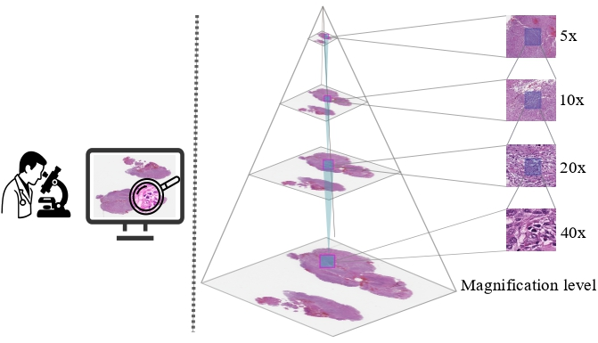
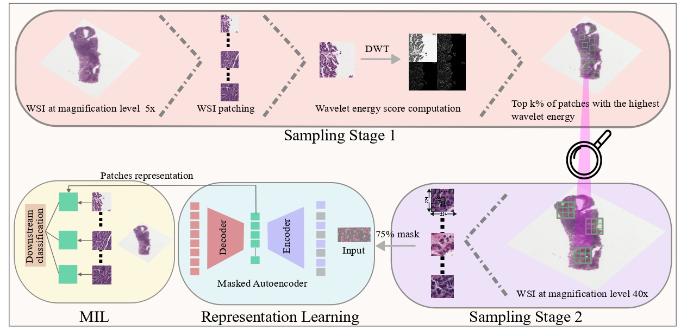

# WISE-MAE

## Wavelet-Informed Sampling for Encoding  
**Learning from the Right Patches for Histopathology Representation Learning**

[[`Paper`](https://doi.org/xx.xxxx/wise-mae)]

<p align="center">
  
</p>

---

## 🧠 Abstract

Self-supervised learning (SSL) offers a scalable solution for computational pathology, but existing models often struggle with the high redundancy of whole slide images (WSIs). We propose **WISE-MAE**, a wavelet-informed two-stage framework that enhances representation learning by focusing on the most informative tissue regions.

Stage 1 leverages wavelet energy maps (via db4 decomposition) to guide patch selection, capturing visually and structurally rich content at 40× magnification. Stage 2 uses these patches to pretrain a ViT encoder using a masked autoencoding objective. The resulting encoder is then frozen and passed to a CLAM attention-based MIL classifier. Across TCGA-NSCLC, TCGA-RCC, and CAMELYON16, WISE-MAE consistently outperforms vanilla MAE and GCMAE, especially in frozen-transfer setups.

---

## 📦 Installation

This repository builds upon [MAE](https://github.com/facebookresearch/mae) and [CLAM](https://github.com/mahmoodlab/CLAM).

```bash
git clone https://github.com/your-repo/wise-mae.git
cd wise-mae
pip install -r requirements.txt
```

---

## 🛠️ Usage

### 1. Pretrain the WISE-MAE Encoder
```bash
python pretrain_mae.py --config configs/mae_pretrain.yaml
```

### 2. Extract Features with the Frozen Encoder
```bash
python extract_features.py --encoder_ckpt checkpoints/mae_encoder.pth
```

### 3. Slide-Level Classification via CLAM
```bash
python train_clam.py --config configs/clam_config.yaml
```

---

## 🧪 Results Summary

All evaluations are performed using frozen ViT encoders passed to CLAM. We report results on three benchmark datasets: TCGA-NSCLC (lung), TCGA-RCC (renal), and CAMELYON16 (breast metastasis detection).

| Model               | Acc (NSCLC) | AUC (NSCLC) | F1 (NSCLC) | Acc (RCC) | AUC (RCC) | F1 (RCC) | Acc (CAM16) | AUC (CAM16) | F1 (CAM16) |
|---------------------|-------------|-------------|------------|-----------|-----------|----------|--------------|--------------|-------------|
| MAE                 | 0.867       | 0.941       | 0.859      | 0.899     | 0.971     | 0.879    | 0.874        | 0.912        | 0.842       |
| GCMAE               | 0.862       | 0.937       | 0.850      | 0.891     | 0.969     | 0.870    | 0.882        | 0.922        | 0.854       |
| WISE-MAE            | 0.868       | 0.944       | 0.860      | 0.903     | 0.973     | 0.885    | 0.894        | 0.935        | 0.866       |
| WISE-MAE + Contrast | **0.869**   | **0.945**   | **0.862**  | **0.906** | **0.974** | **0.887**| **0.901**    | **0.943**    | **0.873**   |

---

## 🌐 Dataset Preparation

- **TCGA-NSCLC**: LUAD vs. LUSC (Lung Cancer)
- **TCGA-RCC**: KIRC vs. KIRP vs. KICH (Renal Cell Carcinoma)
- **CAMELYON16**: Tumor vs. Normal (Breast Metastasis)

Patch extraction uses 224×224 crops at 40× magnification. Coordinates are filtered using db4 wavelet energy maps at 5× resolution.

---

## 🧬 Method Overview

<p align="center">
  
</p>

### Wavelet-Based Patch Selection  
Compute db4 wavelet energy maps at 5× resolution and select top-N high-energy regions.

### Patch Extraction  
Extract 224×224 tiles at 40× magnification for selected coordinates.

### MAE Pretraining  
Use a ViT-base encoder and 75% patch masking for masked autoencoding.

### Feature Freezing  
The encoder is frozen and used to extract patch-level features.

### CLAM Classification  
Train a CLAM model using attention-based MIL for slide-level classification.

---

## 📁 Folder Structure

```bash
wise-mae/
├── mae/                # MAE model and pretraining code
├── patch_selection/    # Wavelet-guided patch sampling logic
├── clam_eval/          # CLAM classification framework
├── pt_files/           # Extracted feature tensors (.pt)
├── h5_files/           # Patch coordinate files (.h5)
├── configs/            # YAML config files
├── results/            # Evaluation logs and metrics
├── figures/            # Figures for publication
└── README.md
```

---

## 📬 Contact

For questions, issues, or collaboration inquiries, please open an issue on GitHub or reach out via the project’s paper link.
